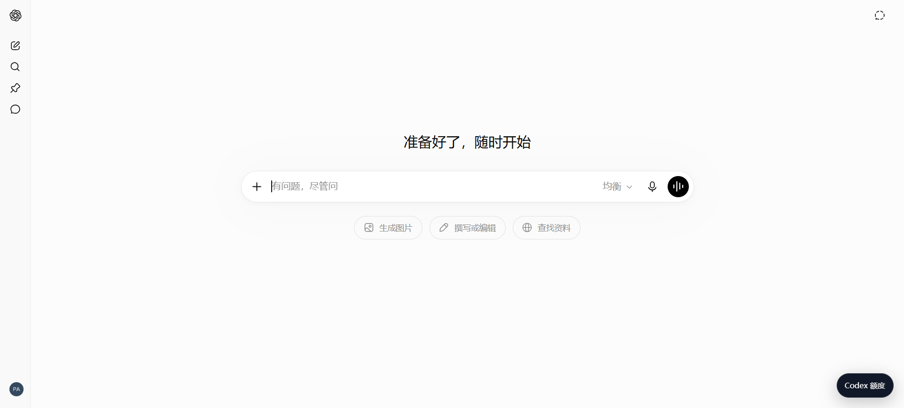
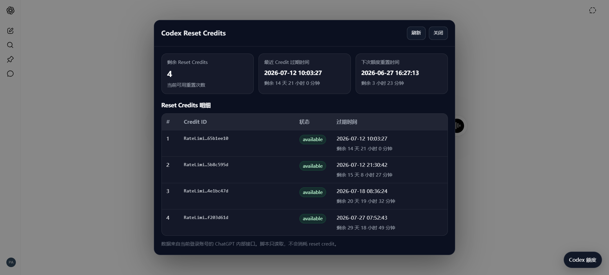

# ChatGPT Codex Reset Credits Viewer

A userscript for `chatgpt.com` that shows Codex reset credits, the nearest credit expiration time, and the next usage reset time for the current signed-in account.

The interface automatically switches between English and Simplified Chinese based on the browser or page language.

[Install on Greasy Fork](https://greasyfork.org/zh-CN/scripts/584519-chatgpt-codex-reset-credits-viewer)

## Screenshots

| Floating entry | Credits panel |
| --- | --- |
|  |  |
